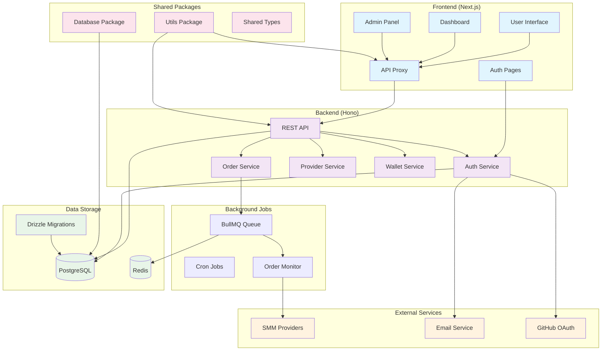
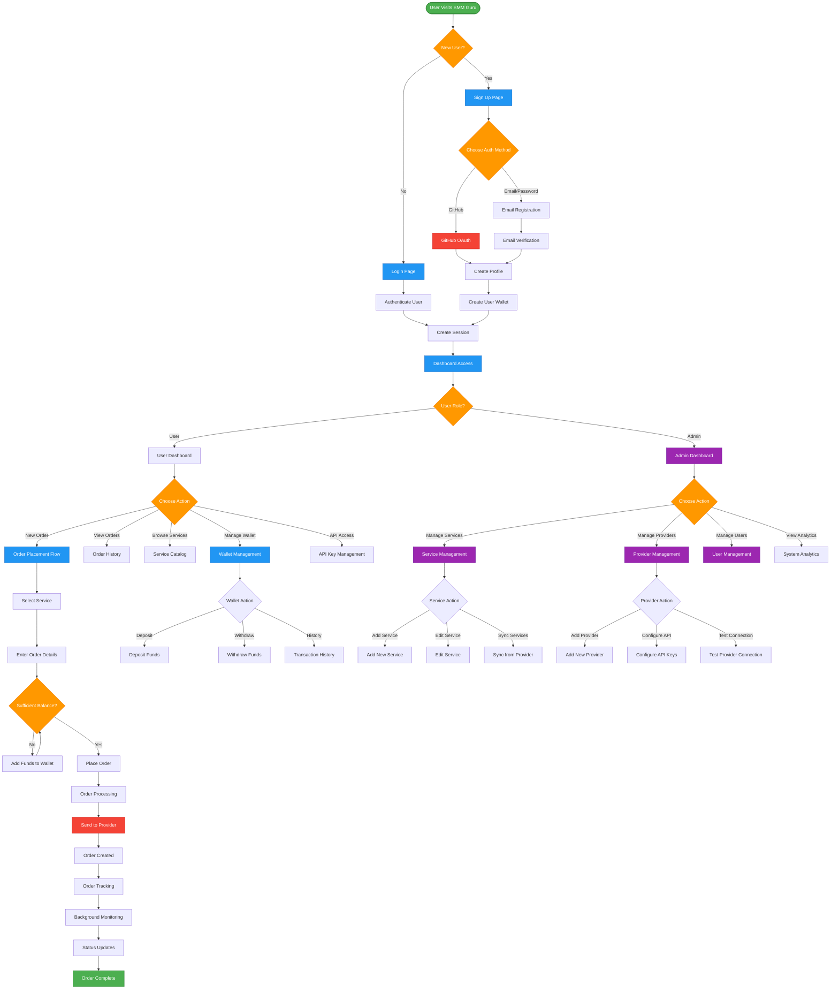
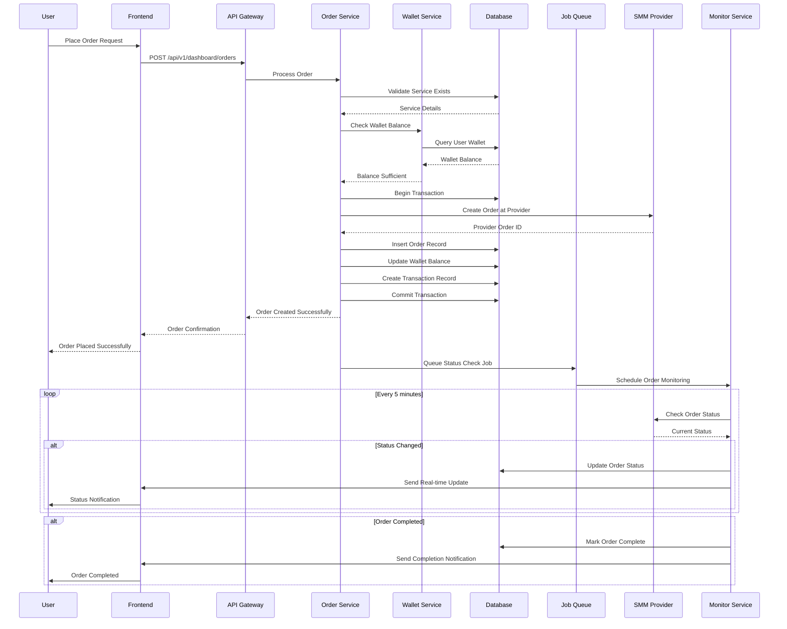
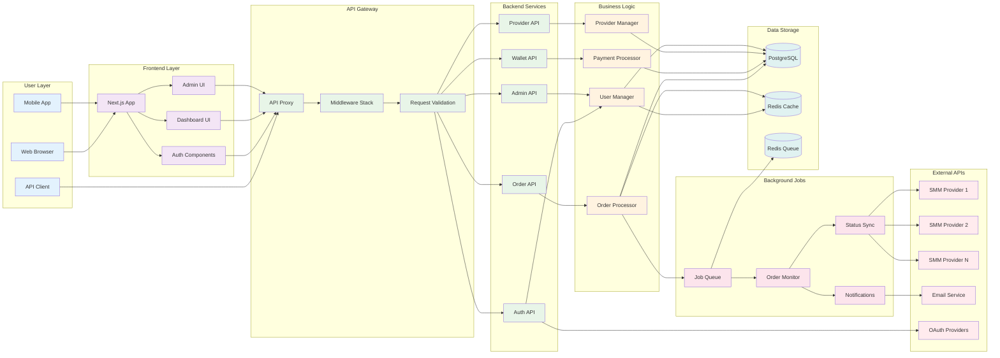

# SMM Guru - System Architecture Diagrams

This document contains comprehensive visual diagrams that illustrate the SMM Guru system architecture, user flows, and technical implementation. These diagrams provide a clear understanding of how the application works at different levels.

## Table of Contents
1. [System Architecture Overview](#system-architecture-overview)
2. [User Journey Flow](#user-journey-flow)
3. [Order Processing Flow (Technical)](#order-processing-flow-technical)
4. [Database Entity Relationship](#database-entity-relationship)
5. [Data Flow Architecture](#data-flow-architecture)

---

## System Architecture Overview

This diagram shows the high-level system components and their relationships across the SMM Guru application.



**Key Components:**
- **Frontend Layer**: Next.js application with different UI sections
- **Backend Layer**: Hono-based API services handling business logic
- **Background Jobs**: BullMQ for asynchronous processing
- **Data Storage**: PostgreSQL for persistent data, Redis for caching/queues
- **External Services**: Third-party integrations for SMM providers and authentication
- **Shared Packages**: Common code shared between frontend and backend

---

## User Journey Flow

This diagram illustrates the complete user experience from registration to order completion, including both user and admin flows.



**Key User Flows:**
- **Authentication**: Multiple authentication methods (email/password, GitHub OAuth)
- **Role-based Access**: Different experiences for users and administrators
- **Order Management**: Complete order lifecycle from placement to completion
- **Financial Management**: Wallet operations and transaction handling
- **Admin Operations**: Provider and service management capabilities

---

## Order Processing Flow (Technical)

This sequence diagram shows the detailed technical flow of order processing, including all service interactions and database operations.



**Technical Process:**
1. **Validation Phase**: Service existence and wallet balance verification
2. **Transaction Phase**: Atomic database operations with provider API calls
3. **Background Processing**: Asynchronous order monitoring and status updates
4. **Real-time Updates**: Live status notifications to users

---

## Database Entity Relationship

This entity-relationship diagram shows the complete database schema with all tables, fields, and relationships.

```mermaid
erDiagram
    %% User Management
    USER {
        text id PK
        text name
        text email UK
        boolean email_verified
        text image
        timestamp created_at
        timestamp updated_at
        text role
        boolean banned
        text ban_reason
        timestamp ban_expires
    }

    ACCOUNT {
        text id PK
        text account_id
        text provider_id
        text user_id FK
        text access_token
        text refresh_token
        timestamp created_at
        timestamp updated_at
    }

    SESSION {
        text id PK
        timestamp expires_at
        text token UK
        text user_id FK
        text ip_address
        text user_agent
        timestamp created_at
        timestamp updated_at
    }

    APIKEY {
        serial id PK
        text name
        text key UK
        timestamp expires_at
        text user_id FK
        timestamp created_at
        timestamp updated_at
    }

    %% SMM Service Management
    PROVIDERS_SCHEMA {
        serial id PK
        text name
        text api_url
        text api_key
        text iv
        text user_id FK
        timestamp created_at
        timestamp updated_at
    }

    SERVICES_CATEGORY {
        serial id PK
        text name
        text user_id FK
        timestamp created_at
        timestamp updated_at
    }

    SERVICES {
        serial id PK
        text service
        text name
        text type
        real rate
        real profit
        integer min
        integer max
        boolean dripfeed
        boolean refill
        boolean cancel
        text category
        text currency
        integer category_id FK
        integer provider_id FK
        text user_id FK
        timestamp created_at
        timestamp updated_at
    }

    %% Order Management
    ORDERS {
        serial id PK
        text link
        boolean refill
        text service_name
        real price
        text currency
        integer provider_order_id
        text status
        integer service FK
        text user_id FK
        timestamp created_at
        timestamp updated_at
    }

    %% Financial System
    WALLET {
        serial id PK
        text user_id FK UK
        numeric balance
        text currency
        text status
        timestamp created_at
        timestamp updated_at
    }

    TRANSACTION {
        serial id PK
        numeric amount
        text type
        text status
        jsonb metadata
        text reference UK
        integer from_wallet_id FK
        integer to_wallet_id FK
        text user_id FK
        timestamp created_at
        timestamp updated_at
    }

    TRANSACTION_FEE {
        serial id PK
        integer transaction_id FK
        numeric fee_amount
        text fee_type
        timestamp created_at
        timestamp updated_at
    }

    %% Relationships
    USER ||--o{ ACCOUNT : "has"
    USER ||--o{ SESSION : "has"
    USER ||--o{ APIKEY : "owns"
    USER ||--o{ PROVIDERS_SCHEMA : "manages"
    USER ||--o{ SERVICES_CATEGORY : "creates"
    USER ||--o{ SERVICES : "owns"
    USER ||--o{ ORDERS : "places"
    USER ||--|| WALLET : "has"
    USER ||--o{ TRANSACTION : "initiates"

    PROVIDERS_SCHEMA ||--o{ SERVICES : "provides"
    SERVICES_CATEGORY ||--o{ SERVICES : "contains"
    SERVICES ||--o{ ORDERS : "generates"

    WALLET ||--o{ TRANSACTION : "from_wallet"
    WALLET ||--o{ TRANSACTION : "to_wallet"
    TRANSACTION ||--o{ TRANSACTION_FEE : "incurs"
```

**Database Structure:**
- **User Management**: Authentication, sessions, and API key management
- **SMM Services**: Provider integration and service catalog management
- **Order Processing**: Order lifecycle and tracking
- **Financial System**: Wallet operations and transaction management
- **Relationships**: Proper foreign key constraints ensuring data integrity

---

## Data Flow Architecture

This diagram shows the complete data flow architecture from user interactions to external service integrations.



**Architecture Layers:**
- **User Layer**: Multiple client types (web, mobile, API)
- **Frontend Layer**: Next.js application with component-based UI
- **API Gateway**: Request routing, middleware, and validation
- **Backend Services**: Microservice-style API endpoints
- **Business Logic**: Core application logic and processing
- **Background Jobs**: Asynchronous processing and monitoring
- **Data Storage**: PostgreSQL for persistence, Redis for caching/queues
- **External APIs**: Third-party service integrations

---

## How to Use These Diagrams

### **Viewing the Diagrams**
These Mermaid diagrams can be viewed in several ways:

1. **GitHub/GitLab**: Most Git platforms render Mermaid diagrams automatically
2. **VS Code**: Use the "Mermaid Preview" extension
3. **Online Viewers**: Copy the diagram code to [mermaid.live](https://mermaid.live)
4. **Documentation Sites**: Platforms like GitBook, Notion, and others support Mermaid

### **Updating the Diagrams**
When the system architecture changes:

1. **Update the relevant diagram** in this file
2. **Test the diagram** using an online Mermaid editor
3. **Commit the changes** to keep documentation in sync
4. **Reference the diagrams** in pull requests and design discussions

### **Integration with Development Workflow**
- **Code Reviews**: Reference these diagrams when reviewing architectural changes
- **Feature Planning**: Use the user journey flow for feature development
- **Onboarding**: Share these diagrams with new team members
- **Documentation**: Include diagram references in technical specifications

### **Maintenance Guidelines**
- **Keep diagrams updated** with code changes
- **Use consistent styling** across all diagrams
- **Add new diagrams** for new major features or architectural changes
- **Validate diagram syntax** before committing changes

---

## Additional Resources

- **Mermaid Documentation**: [https://mermaid-js.github.io/mermaid/](https://mermaid-js.github.io/mermaid/)
- **Diagram Syntax Guide**: [https://mermaid-js.github.io/mermaid/#/flowchart](https://mermaid-js.github.io/mermaid/#/flowchart)
- **Live Editor**: [https://mermaid.live](https://mermaid.live)
- **VS Code Extension**: Search for "Mermaid Preview" in the extension marketplace

These diagrams serve as living documentation that should evolve with the SMM Guru application. They provide valuable insights for developers, stakeholders, and anyone working with or evaluating the system architecture.
