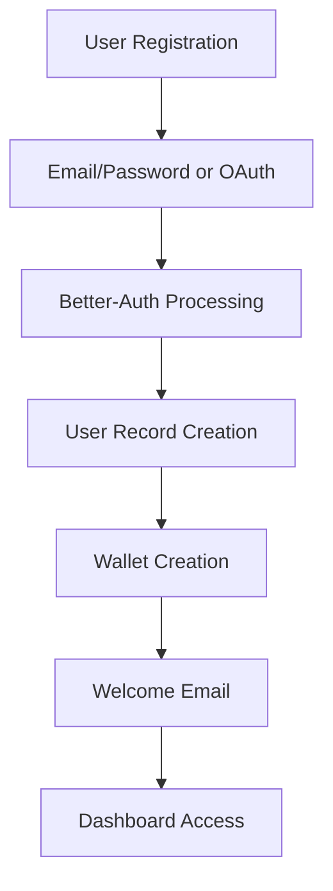
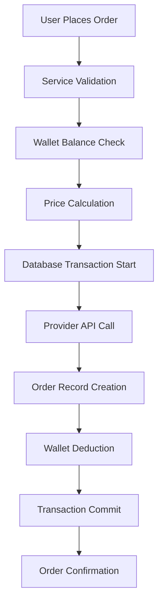

# SMM Guru - Comprehensive Codebase Analysis

## Table of Contents
1. [Project Overview](#project-overview)
2. [Architecture Breakdown](#architecture-breakdown)
3. [Feature Analysis](#feature-analysis)
4. [Dependency Analysis](#dependency-analysis)
5. [Entry Points & Configuration](#entry-points--configuration)
6. [Code Organization](#code-organization)
7. [Database Schema](#database-schema)
8. [Business Logic Flow](#business-logic-flow)
9. [Technical Decisions](#technical-decisions)

## Project Overview

### What is SMM Guru?
**SMM Guru** is a comprehensive **Social Media Marketing (SMM) Panel SaaS application** specifically designed for Instagram marketing services. It serves as a marketplace platform where users can purchase various social media engagement services (followers, likes, comments, views) through integrated third-party providers.

### Core Purpose
- **B2B/B2C SMM Services**: Provide a white-label solution for social media marketing services
- **Provider Aggregation**: Integrate multiple SMM service providers into a single platform
- **Automated Order Processing**: Handle order placement, processing, and fulfillment automatically
- **Financial Management**: Built-in wallet system for deposits, payments, and transaction tracking
- **API-First Approach**: Offer programmatic access for developers and resellers

### Technology Stack

#### Frontend Technologies
- **Framework**: Next.js 15 with App Router
- **Runtime**: React 19
- **Language**: TypeScript
- **Styling**: Tailwind CSS v4
- **UI Components**: shadcn/ui with Radix UI primitives
- **State Management**: Zustand
- **Data Fetching**: TanStack Query (React Query)
- **Forms**: React Hook Form with Zod validation
- **Authentication**: Better-Auth
- **Email**: React Email with Resend

#### Backend Technologies
- **Framework**: Hono (lightweight web framework)
- **Runtime**: Node.js with TypeScript
- **Database**: PostgreSQL
- **ORM**: Drizzle ORM
- **Authentication**: Better-Auth
- **Job Queue**: BullMQ with Redis
- **Validation**: Zod schemas
- **HTTP Client**: Axios

#### Infrastructure & Tools
- **Package Manager**: pnpm with workspaces
- **Database Migrations**: Drizzle Kit
- **Development**: tsx for TypeScript execution
- **Build Tool**: Turbopack (Next.js)
- **Linting**: ESLint with Next.js config
- **Formatting**: Prettier

## Architecture Breakdown

### Monorepo Structure
```
smm-guru/
├── apps/
│   ├── frontend/          # Next.js application (user interface)
│   └── backend/           # Hono API server (business logic)
├── packages/
│   ├── database/          # Shared database schemas & types
│   └── utils/             # Shared utilities & validation schemas
├── drizzle/              # Database migrations (24 migrations)
├── package.json          # Root workspace configuration
├── pnpm-workspace.yaml   # pnpm workspace definition
└── tsconfig.base.json    # Shared TypeScript configuration
```

### Frontend Architecture (`apps/frontend/`)
```
src/
├── app/                   # Next.js App Router
│   ├── (auth)/           # Authentication pages (login, register)
│   ├── (dashboard)/      # User dashboard routes
│   ├── (admin)/          # Admin panel routes
│   ├── (layout)/         # Layout-specific routes
│   ├── api/              # API routes (proxy to backend)
│   ├── layout.tsx        # Root layout with providers
│   └── globals.css       # Global styles and CSS variables
├── components/
│   ├── ui/               # shadcn/ui components
│   ├── global/           # Shared application components
│   └── icon/             # Icon components
├── hooks/                # Custom React hooks
├── lib/                  # Utilities and configurations
│   ├── better-auth/      # Authentication configuration
│   ├── database/         # Database connection
│   ├── constants/        # Application constants
│   └── utils.ts          # Utility functions
├── context/              # React context and state management
│   ├── provider.tsx      # Main context provider
│   └── zustand/          # Zustand store definitions
└── middleware.ts         # Next.js middleware
```

### Backend Architecture (`apps/backend/`)
```
src/
├── app.ts               # Main server entry point
├── routes/              # API route handlers
│   ├── api-keys/        # API key management
│   ├── cron/            # Scheduled job endpoints
│   ├── handler/         # Core business logic handlers
│   └── routes.config.ts # Route configuration
├── lib/                 # Backend utilities
│   ├── better-auth/     # Authentication setup
│   ├── database/        # Database connection
│   ├── middleware/      # Custom middleware
│   └── env.ts           # Environment configuration
└── type/                # TypeScript type definitions
```

### Shared Packages Architecture

#### Database Package (`packages/database/`)
- **Schema Definitions**: All database table schemas using Drizzle ORM
- **Type Exports**: TypeScript types for database entities
- **Relationships**: Database relations and foreign key constraints
- **Migrations**: Schema evolution tracking

#### Utils Package (`packages/utils/`)
- **Zod Schemas**: Validation schemas for API requests/responses
- **Middleware**: Shared middleware functions
- **Status Codes**: HTTP status code constants
- **Error Handlers**: Centralized error handling utilities
- **Hashing Utilities**: Encryption and decryption functions

## Feature Analysis

### User Features (Dashboard)

#### Core SMM Panel Features
- **New Order Placement**: Create orders for Instagram services (followers, likes, etc.)
- **Order Management**: View order history, track status, and manage refills
- **Service Catalog**: Browse available services organized by categories
- **Real-time Order Tracking**: Monitor order progress and completion status
- **API Access**: Generate and manage API keys for programmatic access

#### Financial Features
- **Digital Wallet**: Built-in wallet system for managing funds
- **Transaction History**: Complete audit trail of all financial transactions
- **Multiple Payment Methods**: Support for various deposit methods
- **Automatic Deductions**: Seamless payment processing for orders
- **Currency Support**: Multi-currency support with conversion

#### User Experience Features
- **Responsive Design**: Mobile-first design that works on all devices
- **Dark/Light Theme**: System-aware theme switching
- **Real-time Notifications**: Toast notifications for important events
- **Search & Filtering**: Advanced filtering for services and orders
- **Dashboard Analytics**: Basic usage statistics and insights

### Admin Features (Admin Panel)

#### Provider Management
- **Provider Integration**: Add and configure SMM service providers
- **API Configuration**: Manage provider API keys and endpoints (encrypted storage)
- **Provider Monitoring**: Track provider performance and reliability
- **Service Synchronization**: Sync services from providers automatically

#### Service Management
- **Service Creation**: Add new services with pricing and configuration
- **Category Management**: Organize services into logical categories
- **Pricing Control**: Set profit margins and pricing strategies
- **Service Status**: Enable/disable services based on availability

#### User Administration
- **User Management**: View and manage user accounts
- **Account Controls**: Ban/unban users with reason tracking
- **Role Management**: Assign roles and permissions
- **Financial Oversight**: Monitor user wallets and transactions

#### System Administration
- **Order Monitoring**: Track all orders across the platform
- **System Health**: Monitor application performance and errors
- **Configuration Management**: System-wide settings and configurations
- **Audit Logging**: Comprehensive logging for security and compliance

### Technical Capabilities

#### API Features
- **RESTful API**: Well-structured REST endpoints
- **Authentication**: Session-based and API key authentication
- **Rate Limiting**: Built-in rate limiting for API endpoints
- **Validation**: Comprehensive request/response validation
- **Error Handling**: Standardized error responses

#### Background Processing
- **Job Queue**: BullMQ for handling background tasks
- **Order Processing**: Automated order status checking
- **Scheduled Tasks**: Cron jobs for maintenance and monitoring
- **Retry Logic**: Automatic retry for failed operations

#### Security Features
- **Authentication**: Multi-provider authentication (email, GitHub)
- **Authorization**: Role-based access control
- **Data Encryption**: Encrypted storage of sensitive data (API keys)
- **Session Management**: Secure session handling
- **CORS Configuration**: Proper cross-origin resource sharing setup

## Dependency Analysis

### Frontend Dependencies

#### Core Framework Dependencies
```json
{
  "next": "15.1.6",           // React framework with App Router
  "react": "^19.0.0",         // UI library
  "react-dom": "^19.0.0",     // DOM rendering
  "typescript": "^5"          // Type safety
}
```

#### UI & Styling Dependencies
```json
{
  "@radix-ui/react-*": "^1.1.*",  // Accessible UI primitives
  "tailwindcss": "^4",             // Utility-first CSS framework
  "lucide-react": "^0.484.0",     // Icon library
  "next-themes": "^0.4.6",        // Theme management
  "class-variance-authority": "^0.7.1", // Component variants
  "tailwind-merge": "^3.0.2"      // Tailwind class merging
}
```

#### State Management & Data Fetching
```json
{
  "@tanstack/react-query": "^5.70.0",    // Server state management
  "@tanstack/react-table": "^8.21.2",    // Table management
  "zustand": "^5.0.3",                   // Client state management
  "axios": "^1.8.4"                      // HTTP client
}
```

#### Form Management & Validation
```json
{
  "react-hook-form": "^7.54.2",      // Form management
  "@hookform/resolvers": "^4.1.3",   // Form validation resolvers
  "zod": "^3.24.2"                   // Schema validation
}
```

#### Authentication & Communication
```json
{
  "better-auth": "^1.2.5",              // Authentication framework
  "@react-email/components": "0.0.34",  // Email templates
  "resend": "^4.2.0"                    // Email delivery service
}
```

### Backend Dependencies

#### Core Framework Dependencies
```json
{
  "hono": "^4.7.8",              // Web framework
  "@hono/node-server": "^1.14.1", // Node.js adapter
  "@hono/zod-validator": "^0.4.3", // Request validation
  "typescript": "^5.8.3"         // Type safety
}
```

#### Database & ORM
```json
{
  "drizzle-orm": "^0.43.1",  // TypeScript ORM
  "pg": "^8.15.6",           // PostgreSQL client
  "@types/pg": "^8.11.14"    // PostgreSQL types
}
```

#### Background Processing & Caching
```json
{
  "bullmq": "^5.52.1",    // Job queue management
  "ioredis": "^5.6.1"     // Redis client
}
```

#### Authentication & Security
```json
{
  "better-auth": "^1.2.7",  // Authentication framework
  "zod": "^3.24.3"          // Schema validation
}
```

#### HTTP & External Communication
```json
{
  "axios": "^1.9.0"  // HTTP client for provider APIs
}
```

### Shared Package Dependencies

#### Database Package
- **drizzle-orm**: ORM for database operations
- **pg**: PostgreSQL client library

#### Utils Package
- **zod**: Schema validation across the application
- **hono**: Framework types for middleware
- **axios**: HTTP client utilities

## Entry Points & Configuration

### Application Entry Points

#### Frontend Entry Points
1. **Root Layout**: `apps/frontend/src/app/layout.tsx`
   - Global providers setup
   - Theme configuration
   - Authentication context

2. **Dashboard Layout**: `apps/frontend/src/app/(dashboard)/layout.tsx`
   - Sidebar navigation
   - Header with wallet info
   - Protected route wrapper

3. **Admin Layout**: `apps/frontend/src/app/(admin)/layout.tsx`
   - Admin-specific navigation
   - Role-based access control

4. **API Routes**: `apps/frontend/src/app/api/[[...route]]/route.ts`
   - Proxy to backend services
   - Authentication middleware
   - Request/response handling

#### Backend Entry Points
1. **Main Server**: `apps/backend/src/app.ts`
   - Hono app initialization
   - Middleware stack setup
   - Route configuration
   - Server startup

2. **Route Configuration**: `apps/backend/src/routes/routes.config.ts`
   - API endpoint definitions
   - Route grouping and organization

### Key Configuration Files

#### Database Configuration
```typescript
// apps/frontend/drizzle.config.ts
export default {
  schema: "./src/lib/database/schema.ts",
  out: "./drizzle",
  driver: "pg",
  dbCredentials: {
    connectionString: process.env.DATABASE_URL!,
  },
}
```

#### Next.js Configuration
```typescript
// apps/frontend/next.config.ts
const nextConfig = {
  experimental: {
    turbo: {
      rules: {
        "*.svg": {
          loaders: ["@svgr/webpack"],
          as: "*.js",
        },
      },
    },
  },
}
```

#### Authentication Configuration
```typescript
// apps/frontend/src/lib/better-auth/auth.ts
export const auth = betterAuth({
  database: drizzleAdapter(db, {
    provider: "pg",
    schema: { ...allSchemas },
  }),
  emailAndPassword: { enabled: true },
  socialProviders: {
    github: {
      clientId: GITHUB_CLIENT_ID,
      clientSecret: GITHUB_CLIENT_SECRET,
    },
  },
})
```

#### Workspace Configuration
```yaml
# pnpm-workspace.yaml
packages:
- "packages/*"
- "apps/*"
```

### Environment Variables

#### Frontend Environment Variables
- `DATABASE_URL`: PostgreSQL connection string
- `GITHUB_CLIENT_ID`: GitHub OAuth client ID
- `GITHUB_CLIENT_SECRET`: GitHub OAuth client secret
- `AUTH_DELIVERY_EMAIL`: Email sender address
- `PROJECT_NAME`: Application name
- `REDIS_URL`: Redis connection string

#### Backend Environment Variables
- `PORT`: Server port (default from env.ts)
- `DATABASE_URL`: PostgreSQL connection string
- `REDIS_URL`: Redis connection for job queue
- `AES_SECRET_KEY`: Encryption key for sensitive data

### Startup Process

#### Development Mode
```bash
# Install dependencies
pnpm install

# Start all services in parallel
pnpm dev
```

#### Production Build
```bash
# Build all packages
pnpm build

# Start production servers
pnpm start
```

#### Database Setup
```bash
# Generate migrations
pnpm db:gen

# Push schema to database
pnpm db:push

# Run migrations
pnpm db:mig
```

## Code Organization

### Naming Conventions

#### File Naming
- **Components**: PascalCase (e.g., `UserProfile.tsx`)
- **Pages**: kebab-case (e.g., `new-orders/page.tsx`)
- **Utilities**: kebab-case (e.g., `auth-client.ts`)
- **Types**: kebab-case with `.type.ts` suffix
- **Schemas**: kebab-case with `.zod.ts` suffix

#### Directory Structure Patterns
- **Route Groups**: Parentheses for layout grouping `(dashboard)`, `(admin)`
- **Private Folders**: Underscore prefix `_components`, `_routes`
- **Feature Folders**: Co-located components with their pages

### Component Organization

#### Page-Level Organization
```
app/(dashboard)/dashboard/orders/
├── page.tsx                    # Main page component
├── _components/               # Page-specific components
│   ├── order-list.tsx
│   ├── order-filters.tsx
│   └── order-status.tsx
└── loading.tsx               # Loading UI
```

#### Shared Component Structure
```
components/
├── ui/                       # shadcn/ui components
│   ├── button.tsx
│   ├── input.tsx
│   └── sidebar.tsx
├── global/                   # Application-wide components
│   ├── logo.tsx
│   └── theme-toggle.tsx
└── icon/                     # Custom icon components
```

### Import Organization

#### Import Order Convention
```typescript
// 1. React and Next.js imports
import React from "react"
import { NextPage } from "next"

// 2. Third-party library imports
import { useQuery } from "@tanstack/react-query"
import { Button } from "@/components/ui/button"

// 3. Internal imports (absolute paths)
import { useSession } from "@/lib/better-auth/auth-client"
import { ApiResponse } from "@/@types/response.type"

// 4. Relative imports
import OrderCard from "./order-card"
```

#### Path Aliases Configuration
```json
{
  "@/*": ["./src/*"],
  "@/components/*": ["./src/components/*"],
  "@/lib/*": ["./src/lib/*"],
  "@/hooks/*": ["./src/hooks/*"]
}
```

### State Management Patterns

#### Zustand Store Organization
```typescript
// context/zustand/store.ts
export const useProviderId = create<ProviderIdState>((set) => ({
  selectedProviderId: null,
  setSelectedProviderId: (id) => set(() => ({ selectedProviderId: id })),
}))

export const useCurrency = create<CurrencyState>((set) => ({
  currency: null,
  setCurrency: (currency) => set(() => ({ currency: currency })),
}))
```

#### React Query Organization
```typescript
// hooks/use-services.ts
const useServices = (props: { currency?: string }) => {
  const { currency } = useCurrency()

  const { data, isLoading, error } = useQuery({
    queryKey: ["services", props?.currency || currency],
    queryFn: () => getServicesWithCat(currency),
    enabled: !!currency,
  })

  return { data, isLoading }
}
```

### API Route Organization

#### Backend Route Structure
```typescript
// routes/routes.config.ts
const routes = new Hono()

routes.route("/api-key", apiKeyRoute)      // API key management
routes.route("/handler", handlerRoute)     // Core business logic
routes.route("/cron/order", orderCronRoute) // Scheduled tasks
```

#### Frontend API Proxy Structure
```typescript
// app/api/[[...route]]/_routes/config.route.ts
const routes = new Hono()

routes.route("/admin/providers", addProviderRoute)
routes.route("/admin/services", serviceRoute)
routes.route("/dashboard/orders", orderRoute)
```

## Database Schema

### Core Tables Overview

#### Authentication & User Management
```sql
-- User accounts and authentication
user (id, name, email, email_verified, image, created_at, updated_at, role, banned, ban_reason, ban_expires)
account (id, account_id, provider_id, user_id, access_token, refresh_token, ...)
session (id, expires_at, token, created_at, updated_at, ip_address, user_agent, user_id)
verification (id, identifier, value, expires_at, created_at)
apikey (id, name, key, expires_at, user_id, created_at, updated_at)
```

#### SMM Service Management
```sql
-- Provider and service configuration
providers_schema (id, name, api_url, api_key, iv, user_id, created_at, updated_at)
services_category (id, name, user_id, created_at, updated_at)
services (id, service, name, type, rate, profit, min, max, dripfeed, refill, cancel, category, currency, category_id, provider_id, user_id, created_at, updated_at)
```

#### Order Processing
```sql
-- Order management and tracking
orders (id, link, refill, service_name, price, currency, provider_order_id, status, service, user_id, created_at, updated_at)
```

#### Financial System
```sql
-- Wallet and transaction management
wallet (id, user_id, balance, currency, status, created_at, updated_at)
transaction (id, amount, type, status, metadata, reference, from_wallet_id, to_wallet_id, user_id, created_at, updated_at)
transaction_fee (id, transaction_id, fee_amount, fee_type, created_at, updated_at)
```

### Database Relationships

#### User-Centric Relationships
```typescript
// User has many relationships
user -> providers_schema (one-to-many)
user -> services_category (one-to-many)
user -> services (one-to-many)
user -> orders (one-to-many)
user -> wallet (one-to-one)
user -> transactions (one-to-many)
user -> apikey (one-to-many)
```

#### Service Management Relationships
```typescript
// Provider -> Services -> Orders flow
providers_schema -> services (one-to-many)
services_category -> services (one-to-many)
services -> orders (one-to-many)
```

#### Financial Relationships
```typescript
// Wallet and transaction relationships
wallet -> transaction (one-to-many as from_wallet)
wallet -> transaction (one-to-many as to_wallet)
transaction -> transaction_fee (one-to-many)
```

### Data Types and Constraints

#### Key Data Types
- **IDs**: `text` for user IDs, `serial` for auto-increment IDs
- **Timestamps**: `timestamp` with `defaultNow()` for created_at
- **Money**: `numeric(20, 2)` for precise financial calculations
- **Status**: `text` with type constraints using `$type<>`
- **JSON**: `jsonb` for flexible metadata storage

#### Important Constraints
- **Unique Constraints**: Email, API keys, transaction references
- **Foreign Keys**: Cascade delete for user-owned resources
- **Check Constraints**: Status enums, positive amounts
- **Not Null**: Required fields like user_id, created_at

### Migration Strategy

#### Migration Files (24 total migrations)
```
drizzle/
├── 0000_boring_wallflower.sql      # Initial schema
├── 0001_military_gwen_stacy.sql    # User enhancements
├── ...                             # Incremental changes
└── 0023_white_rhodey.sql           # Latest schema
```

#### Schema Evolution Pattern
1. **Initial Setup**: Basic auth tables and user management
2. **SMM Features**: Provider, service, and category tables
3. **Order System**: Order processing and tracking
4. **Financial System**: Wallet and transaction management
5. **API Features**: API key management and access control

## Business Logic Flow

### User Registration & Authentication Flow

#### 1. User Registration


#### 2. Authentication Process
- **Email/Password**: Standard credential validation
- **GitHub OAuth**: Social provider integration
- **Session Management**: Secure session tokens with expiration
- **API Key Access**: Alternative authentication for developers

### SMM Service Discovery Flow

#### 1. Service Catalog Browsing
```typescript
// Service discovery process
1. User accesses services page
2. System fetches services by category
3. Currency-based filtering applied
4. Provider availability checked
5. Services displayed with pricing
```

#### 2. Service Data Flow
```
Provider API -> Service Sync -> Database Storage -> User Interface
```

### Order Processing Flow

#### 1. Order Placement Process


#### 2. Order Processing Logic
```typescript
// Core order processing in handler.route.ts
async function processOrder(orderData) {
  return await db.transaction(async (tx) => {
    // 1. Validate user wallet balance
    const wallet = await tx.query.wallet.findFirst({
      where: eq(wallet.userId, userId)
    })

    // 2. Check sufficient funds
    if (Number(wallet.balance) < calculatedPrice) {
      throw new Error("Insufficient balance")
    }

    // 3. Call provider API
    const providerResponse = await axios.post(providerUrl, orderPayload)

    // 4. Create order record
    const order = await tx.insert(orderSchema).values({
      link: orderData.link,
      service: orderData.service,
      userId: userId,
      price: calculatedPrice,
      providerOrderId: providerResponse.data.order
    })

    // 5. Deduct from wallet
    await tx.update(wallet).set({
      balance: sql`${wallet.balance} - ${calculatedPrice}`
    })

    return order
  })
}
```

### Background Job Processing

#### 1. Order Status Monitoring
```typescript
// Cron job for order status updates
export const orderStatusCron = new Hono()

orderStatusCron.get("/", async (c) => {
  // 1. Fetch all providers
  const providers = await db.query.providersSchema.findMany()

  // 2. For each provider, check pending orders
  await Promise.all(providers.map(async (provider) => {
    const orders = await db.query.orderSchema.findMany({
      where: eq(orderSchema.status, "PENDING")
    })

    // 3. Check status with provider API
    await Promise.all(orders.map(async (order) => {
      const statusResponse = await axios.post(provider.apiUrl, {
        key: decryptedApiKey,
        action: "status",
        order: order.providerOrderId
      })

      // 4. Update order status if completed
      if (statusResponse.data.status.toLowerCase() === "completed") {
        await db.update(orderSchema)
          .set({ status: "COMPLETED" })
          .where(eq(orderSchema.id, order.id))
      }
    }))
  }))
})
```

#### 2. Job Queue Management
- **BullMQ Integration**: Reliable job processing with Redis
- **Retry Logic**: Automatic retry for failed operations
- **Job Scheduling**: Cron-based scheduling for regular tasks
- **Error Handling**: Comprehensive error tracking and logging

### Financial Transaction Flow

#### 1. Wallet Management
```typescript
// Wallet operations
interface WalletOperation {
  userId: string
  amount: number
  type: 'deposit' | 'withdrawal' | 'debit'
  reference?: string
}

async function processWalletTransaction(operation: WalletOperation) {
  return await db.transaction(async (tx) => {
    // 1. Update wallet balance
    await tx.update(wallet)
      .set({
        balance: sql`${wallet.balance} + ${operation.amount}`
      })
      .where(eq(wallet.userId, operation.userId))

    // 2. Create transaction record
    await tx.insert(transaction).values({
      userId: operation.userId,
      amount: operation.amount,
      type: operation.type,
      status: 'completed',
      reference: operation.reference
    })
  })
}
```

#### 2. Payment Processing Integration
- **Multiple Payment Methods**: Support for various deposit methods
- **Transaction Tracking**: Complete audit trail for all financial operations
- **Currency Support**: Multi-currency handling with conversion
- **Fee Management**: Configurable transaction fees

### Provider Integration Flow

#### 1. Provider API Integration
```typescript
// Provider API communication
interface ProviderAPI {
  createOrder(params: {
    key: string
    action: 'add'
    service: number
    link: string
    quantity: number
  }): Promise<{ order: number }>

  checkStatus(params: {
    key: string
    action: 'status'
    order: number
  }): Promise<{ status: string }>
}
```

#### 2. Provider Management
- **API Key Encryption**: Secure storage of provider credentials
- **Service Synchronization**: Automatic sync of available services
- **Provider Monitoring**: Health checks and performance tracking
- **Failover Logic**: Automatic switching between providers

## Technical Decisions

### Architecture Patterns

#### 1. Monorepo with Shared Packages
**Decision**: Use pnpm workspaces for code sharing
**Rationale**:
- Reduces code duplication between frontend and backend
- Ensures type safety across the entire application
- Simplifies dependency management
- Enables atomic changes across multiple packages

#### 2. API-First Design
**Decision**: Separate frontend and backend with well-defined APIs
**Rationale**:
- Enables independent scaling of frontend and backend
- Supports multiple client types (web, mobile, API consumers)
- Clear separation of concerns
- Better testability and maintainability

#### 3. Database-First Approach
**Decision**: Use Drizzle ORM with schema-first design
**Rationale**:
- Type safety from database to application layer
- Automatic type generation from schema
- Migration management and version control
- Better performance than traditional ORMs

### Security Measures

#### 1. Authentication Strategy
**Decision**: Better-Auth with multiple providers
**Rationale**:
- Modern authentication with built-in security features
- Support for multiple authentication methods
- Session management with secure defaults
- API key support for programmatic access

#### 2. Data Encryption
**Decision**: Encrypt sensitive data (API keys) at rest
**Implementation**:
```typescript
// Encryption for provider API keys
const encryptedData = encrypt(apiKey, secretKey)
const decryptedData = decrypt(encryptedApiKey, iv, secretKey)
```

#### 3. Input Validation
**Decision**: Zod schemas for comprehensive validation
**Benefits**:
- Runtime type checking
- Consistent validation across frontend and backend
- Automatic TypeScript type inference
- Clear error messages for invalid data

### Scalability Considerations

#### 1. Background Job Processing
**Decision**: BullMQ with Redis for job queue
**Benefits**:
- Reliable job processing with persistence
- Horizontal scaling capability
- Built-in retry and error handling
- Job prioritization and scheduling

#### 2. Database Design
**Decision**: Relational database with proper indexing
**Considerations**:
- ACID compliance for financial transactions
- Foreign key constraints for data integrity
- Optimized queries with proper indexing
- Connection pooling for performance

#### 3. Caching Strategy
**Decision**: Redis for caching and session storage
**Implementation**:
- Session data caching
- Frequently accessed data caching
- Job queue persistence
- Rate limiting storage

### Performance Optimizations

#### 1. Frontend Optimizations
- **Next.js App Router**: Improved performance and developer experience
- **Turbopack**: Faster development builds
- **React Query**: Efficient data fetching and caching
- **Code Splitting**: Automatic code splitting with Next.js

#### 2. Backend Optimizations
- **Hono Framework**: Lightweight and fast web framework
- **Connection Pooling**: Efficient database connection management
- **Async Processing**: Non-blocking operations for better throughput
- **Optimized Queries**: Efficient database queries with proper joins

### Development Experience

#### 1. Type Safety
**Decision**: End-to-end TypeScript with strict configuration
**Benefits**:
- Catch errors at compile time
- Better IDE support and autocomplete
- Safer refactoring
- Self-documenting code

#### 2. Code Quality
**Tools Used**:
- **ESLint**: Code linting and style enforcement
- **Prettier**: Consistent code formatting
- **TypeScript**: Static type checking
- **Zod**: Runtime validation

#### 3. Development Workflow
**Features**:
- **Hot Reload**: Fast development iteration
- **Parallel Development**: Independent frontend/backend development
- **Shared Types**: Consistent types across packages
- **Migration Management**: Version-controlled database changes

### Deployment Considerations

#### 1. Environment Management
- **Environment Variables**: Secure configuration management
- **Multi-Environment Support**: Development, staging, production
- **Secret Management**: Encrypted storage of sensitive data

#### 2. Database Management
- **Migration Strategy**: Incremental schema changes
- **Backup Strategy**: Regular database backups
- **Connection Management**: Proper connection pooling and limits

#### 3. Monitoring and Logging
- **Error Tracking**: Comprehensive error logging
- **Performance Monitoring**: Application performance metrics
- **Audit Logging**: Security and compliance logging

This comprehensive analysis provides a complete understanding of the SMM Guru codebase, its architecture, and the technical decisions that shape its implementation. The application represents a well-architected, modern SaaS platform built with current best practices and scalable technologies.
